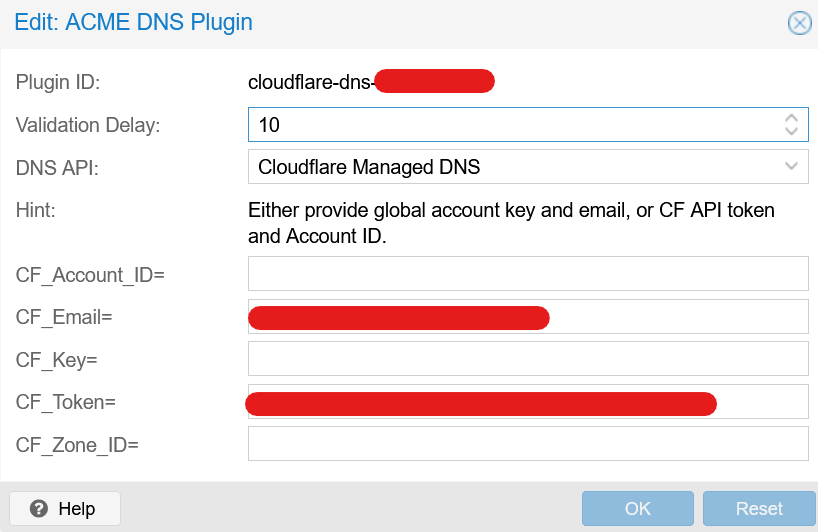
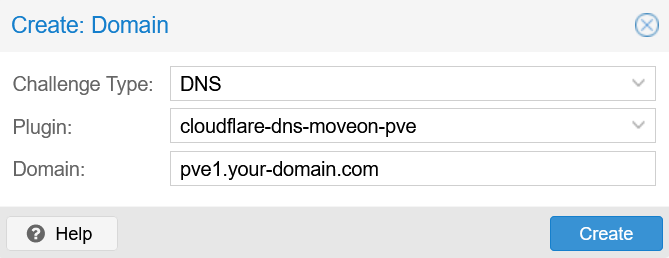

<!-- # Table of contents
- [1\. Setup](#1-setup)
- [2\. Production configuration](#2-production-configuration)
    - [2.1 Change IP and gateway](#21-change-ip-and-gateway)
    - [2.2 Setup certificate management with ACME](#22-setup-certificate-management-with-acme) -->
[TOC]

How to prepare a Proxmox server for running Home Assistant in a virtual machine. The first part covers the initial setup of Proxmox, including the installation, configuration, and certificate management.

# 1\. Setup Proxmox

1.  Download ISO and flash on USB Stick with Balena Etcher
2.  BIOS Settings
    - Disable secure boot
    - Enable nested virtualization for VMs (KVM virtualization) to work
        - _Example_: [HP PCs - Enable Virtualization Technology in the BIOS](https://support.hp.com/us-en/document/ish_5637142-5637191-16)
3.  Flash OS on SSD and reboot
4.  Follow on-screen configuration instructions
5.  `ssh-copy-id root@<your-ip-address>`
6.  `ssh root@<your-ip-address>`
7.  Run `bash -c "$(wget -qLO - https://github.com/tteck/Proxmox/raw/main/misc/post-pve-install.sh)"`
8.  Follow terminal prompts. ⚠️ wait for PVE update to finish if selected, this may take several minutes ⚠️
9.  Reboot

# 2\. Production configuration

## 2.1 Change IP and gateway

1.  change gateway (and IP) in `/etc/network/interfaces`
2.  Only when IP changed: `/etc/hosts`
3.  Change DNS in `/etc/resolv.conf`

## 2.2 Setup certificate management with ACME

1.  Datacenter (top level) -> ACME
2.  Accounts -> Add -> configure
3.  In cloudflare dashboard:
    - My profile (upper right) -> API Tokens
    - Create Token: <token-name>, Permissions: Zone.DNS:Edit, Resources: 1 Zone</token-name>
    - Create secure note in PW manager
    - Test w/ CURL command

```bash
curl -X GET "https://api.cloudflare.com/client/v4/user/tokens/verify" \
     -H "Authorization: Bearer <api-token>" \
     -H "Content-Type:application/json"
```

```json
{
  "result": {
    "id": "238a33976d2cf7dfba07e9951ddad1cf",
    "status": "active"
  },
  "success": true,
  "errors": [],
  "messages": [
    {
      "code": 10000,
      "message": "This API Token is valid and active",
      "type": null
    }
  ]
}
```

4.  Challenge Plugins -> Add, use the following config:

    {.center .small}

5.  Go back to server -> System -> Certificates -> ACME -> Add:

    {.center .small}

6.  Press "Order Certificates Now"
    
7.  Add DNS record in local DNS resolver (e.g., router, pihole, etc.)

**Sources**

- [How to Change Primary Proxmox VE IP Address](https://www.servethehome.com/how-to-change-primary-proxmox-ve-ip-address/)
- [How to change my DNS?](https://forum.proxmox.com/threads/how-to-change-my-dns.52879/)
- [Proxmox Helper Scripts](https://tteck.github.io/Proxmox/)
- [Proxmox Docs | Trusted certificates via Let's Encrypt ACME](https://pve.proxmox.com/wiki/Certificate_Management#sysadmin_certs_get_trusted_acme_cert)
- Help function in Proxmox UI